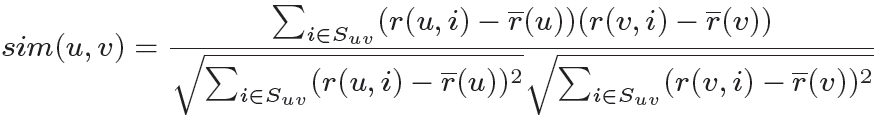
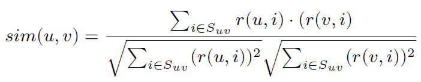
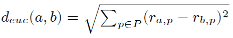
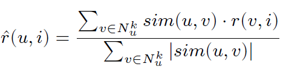
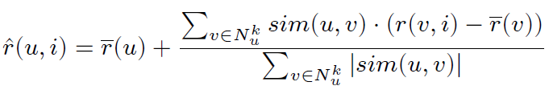
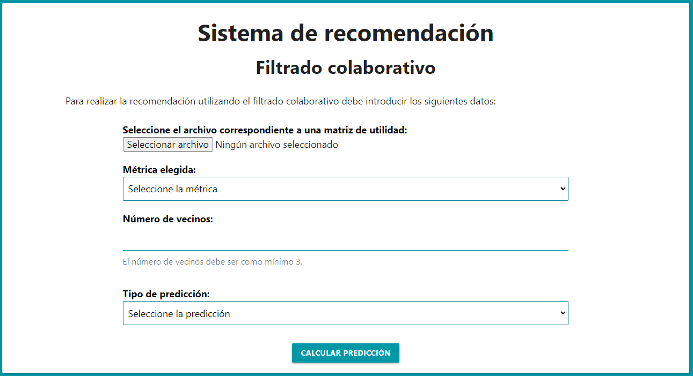

# Gestión del Conocimiento en las organizaciones
## Sistemas de recomendación
### Autor: Alberto Mendoza Rodríguez (alu0101217741@ull.edu.es)


<p align="center">
  <br>
  Acceda al sistema de recomendación: <a href="https://alu0101217741.github.io/Sistema_de_recomendacion_GCO/">https://alu0101217741.github.io/Sistema_de_recomendacion_GCO/</a>
  <br>
</p>


## 1. Introducción

Este repositorio incluye el código fuente que implementa un sistema de recomendación basado en el filtrado colaborativo. El paradigma para desarrollar este sistema se basa en la teoría de que si los usuarios han compartido algunos de sus interes en el pasado, podrán tener gustos similares en el futuro.

Para desarrollar el sistema de recomendación se han utilizado los lenguajes de programación **HTML**, **CSS** y  **JavaScript** de forma que el usuario puede introducir los datos necesarios para realizar la recomendación a través de una página web y obtener los resultados en la pantalla de su navegador. Cabe destacar que para establecer el estilo de la página también se ha empleado el framework de CSS  [Materialize](https://materializecss.com/).

## 2. Estructura de directorios

El sistema de recomendación se encuentra dentro de **docs** que incluye los siguientes directorios y ficheros:

* **css**: Almacena la hoja de estilo **style.css** para definir la presentación para el documento escrito en HTML.
* **example-utility-matrices**: Incluye diferentes ejemplos de matrices de utilidad con las que se puede comprobar el correcto funcionamiento del programa.
* **src**: Almacena los siguientes ficheros con código JavaScript:

  * **formulario.js**: Permite gestionar el formulario donde el usuario debe introducir los datos y hace posible mostrar los resultados. 
   
  * **recomendador.js**: Se define la clase **Recomendador** que implementa la recomendación basada en el filtrado colaborativo, de forma que calcula la matriz de similitud, la matriz de utilidad con las predicciones resueltas, los vecinos seleccionados y el cálculo realizado en cada predicción.
 
* **index.html**: Documento escrito con el lenguaje de marcado HTML para elaborar la página web.

## 3. Descripción del código desarrollado
A continuación, se describe el contenido de cada uno de los ficheros que forman el sistema de recomendación.

### 3.1. index.html
En primer lugar, el fichero **index.html** contiene el formulario donde el usuario debe introducir los siguientes datos:

* Fichero con la matriz de utilidad compuesta por las calificaciones de usuarios-ítems.
* Métrica elegida, pudiendo seleccionar entre Correlación de Pearson, Distancia coseno y Distancia Euclídea.
* Número de vecinos considerados.
* El tipo de predicción, que puede ser predicción simple o diferencia con la media.

Cuando el usuario termina de introducir estos parámetros debe pulsar el botón `CALCULAR PREDICCIÓN` y se mostrarán la matriz de similitud, la matriz de utilidad con las predicciones resueltas, los vecinos seleccionados y el cálculo realizado en cada predicción.

Como ya se ha comentado anteriormente para aportar una adecuada presentación a este documento se ha empleado Materialize y la hoja de estilo style.css.

### 3.2. formulario.js

Este fichero permite obtener los datos introducidos por el usuario en el formulario, lo que hace posible almacenarlos en variables y calcular las predicciones. Para realizar esta interacción se ha empleado el evento `click` sobre el botón del formulario que tiene el id `read_button`.

```js
document.getElementById('read_button').addEventListener('click', function() {
```

De esta forma cuando se pulse el botón se comprueba que el usuario ha introducido un fichero, tras ello se obtienen los datos del formulario relativos a la métrica, el número de vecinos y el tipo de predicción. 

Una vez hecho esto, se procesa el fichero que incluye la matriz de utilidad, para lo que se toma el nombre del documento y se crea un objeto de la clase `FileReader()`. Luego se lee como un fichero de texto mediante `reader.readAsText(file);` y se emplean dos nuevos eventos sobre el objeto `reader`. El primero es `load` que se ejecuta cuando  ha finalizado correctamente la lectura del fichero. El otro es `error` que se ejecuta si ha ocurrido algún error en la lectura del fichero para informar al usuario.

Dentro del evento `load` se obtienen los datos leídos del fichero y se tranforman para crear una matriz de utilidad con datos numéricos, cambiando el **"-"** por el **-1**.

Tras ello, se crea el objeto `recomendador` de la clase `Recomendador` pasándole los valores recogidos del formulario.

```js
 const recomendador = new Recomendador(matrix, metrica, num_vecinos, tipo_prediccion);
 ```
 Por último, se llaman a los métodos de la clase `Recomendador` para obtener los resultados y se muestran en la página web empleando las funciones `mostrar_matriz`, `mostrar_vecinos` y `mostrar_calculo` que incorporan código HTML.
 
 ### 3.3. recomendador.js
 
 Este fichero incluye la clase `Recomendador` que implementa un recomendador siguiendo el método del filtrado colaborativo.
 
 ### Constructor
 El constructor de la clase es el que se muestra a continuación:
 
 ```js
 constructor(matriz, metrica, num_vecinos, tipo_prediccion) {
        this.matriz_utilidad = matriz;
        this.metrica = metrica;
        this.num_vecinos = num_vecinos;
        this.tipo_prediccion = tipo_prediccion;
        this.matriz_similitud = this.crear_matriz_similitud(metrica);
        this.vecinos_usuarios = [];
        this.calculo_predicciones = [];
    }
  ```
  
Con los parámetros recibidos se inicializan algunos de los atributos de la clase que son los siguientes: 

* `this.matriz_utilidad:` es la matriz de utilidad original que incluye un -1 en las posiciones donde un usuario no ha calificado un determinado ítem.
* `this.metrica`: el tipo de métrica elegida.
* `this.num_vecinos`: el número de vecinos considerados.
* `this.tipo_predicción`: el tipo de predicción que se tendrá que aplicar para realizar los cálculos.
* `this.matriz_similitud`: se trata de una matriz cuadrada donde se indica el grado de relación entre cada para de usuarios.
* `this.vecinos_usuarios`: es una matriz donde cada fila sigue la estructura `[usuario, item, vecinos]` donde `vecinos` es un array con los vecinos del usuario para ese determinado `item`. Se utiliza para almacenar los vecinos de los usuarios y poderlos mostrar como parte de los resultados.
* `this.calculo_predicciones`: es una matriz donde las filas pueden seguir dos estructuras diferentes en función del tipo de predicción:
  * Predicción simple: La estructura de cada fila es `[usuario, item, sumatorio1, sumatorio2, prediccion]`.
  * Predicción basada en la diferencia con la media: La estructura de cada fila es `[usuario, item, media_usuario, sumatorio1, sumatorio2, prediccion]`.
 
En ambas estructuras la variable `prediccion` almacena el cálculo final de la predicción. Al igual que en `this.vecinos_usuarios`, esta matriz se emplea para mostrar el proceso que se ha seguido para obtener los resultados en las diferentes predicciones.

### crear_matriz_similitud(metrica)

Para generar la matriz de similaridad se llama desde el constructor al método `crear_matriz_similitud(metrica)` pasándole el tipo de métrica que se esta utilizando. En este método se va a crear una matriz cuadrada formada tanto en las filas como en las columnas por usuarios, de forma que se muestra el grado de relación entre cada par de usuarios. Para lograrlo se recorre por filas la matriz de utilidad y se calcula la similitud de un usuario `i` con el resto, el resultado obtenido depende de la métrica que se este aplicando.

### correlacion_pearson(usuario_u, usuario_v)

Este método aplica la medida de similitud basada en la correlación de Pearson que se trata de un índice que se puede emplear para medir la relación entre dos variables cuantitativas y continuas. 

En primer lugar, se calculan las medias para ambos usuarios, para lo que se utilizan todos las valoraciones, independientemente si el otro usuario ha valorado ese item o no. Después se recorre por ítems la matriz de utilidad comprobando que el item haya sido calificado por ambos usuarios, y si esto es así se calculan los sumatorios que componen la siguiente fórmula:



Por último, cuando se tienen los sumatorios se aplica las operaciones de la fórmula y se devuelve el resultado. Cabe destacar que la similitud obtenida ouede variar desde -1 hasta 1 y aporta la siguiente información:

* Si `sim(u, v) = 1`, correlación directa perfecta.
* Si `0 < sim(u, v) < 1`, correlación directa.
* Si `sim(u, v) = 0`, no hay correlación.
* Si `−1 < sim(u, v) < 0`, correlación inversa.
* Si `sim(u, v) = −1`, correlación inversa perfecta.

### distancia_coseno(usuario_u, usuario_v)
  
Otra de las métricas que se puede aplicar es la distancia coseno donde el recorrido de la matriz de utilidad se hace de la misma forma que en el método anterior, pero en este caso se aplica la siguiente fórmula:


  
Los valores de similitud que se pueden obtener varía desde 0 hasta 1 e indican lo siguiente:

* Si `sim(u, v) = 1`, correlación directa perfecta.
* Si `0 < sim(u, v) < 1`, correlación directa.
* Si `sim(u, v) = 0`, no hay correlación.
  
### distancia_euclidea(usuario_u, usuario_v)

La última métrica es la distancia Euclídea donde también se recorre la matriz de utilidad para verificar que los dos usuarios hayan calificado ese item, y en ese caso se calcula el sumatorio que se emplea en la siguiente fórmula:



Finalmente se aplica la raíz cuadrada sobre el sumatorio y se devuelve el resultado. 
  
### calcular_vecinos(usuario, item)
  
Cuando se calculan las predicciones para los ítems no calificados es necesario disponer de los vecinos más próximos del usuario, en este método se calculan dichos vecinos. Este método recibe como parámetro el número que identifica a un usuario y un determiando ítem.

Primero se recorre la matriz de utilidad por filas y se añade al vector `similitud_vecinos` todos los vecinos de ese usuario, para incluirlos se utilizan objetos formados por las claves `vecino` y `similitud`.  
 
```js
  for (let i = 0; i < this.matriz_utilidad.length; i++) {
    if (i != usuario)
      similitud_vecinos.push({vecino: i, similitud: this.matriz_similitud[usuario][i]});
  }
 ```

Cuando se dispone de todos los vecinos de un usuario hay que ordenarlos según la similitud, si se ha empleado la métrica basada en la correlación de Pearson o la distancia coseno se ordenan de mayor a menor, pero si se ha utilizado la distancia euclídea el orden es de menor a mayor.

Por último, se recorre el vector `similitud_vecinos` para comprobar si el vecino ha valorado el ítem pasado como parámetro, si esto es así se incluye en el vector `seleccion_vecinos`. Esto se repite mientras `seleccion_vecinos` tenga un tamaño menor que el número de vecinos considerados, o no queden más vecinos dentro de `similitud_vecinos` que cumplan con esta característica. La comprobación realizada aquí es necesaria ya que en el cálculo de las predicciones los vecinos tienen que haber valorado el item cuya valoración se va a predecir.

```js
  let i = 0;
  while ((seleccion_vecinos.length < this.num_vecinos) && (i < similitud_vecinos.length)) {
    if (this.matriz_utilidad[similitud_vecinos[i].vecino][item] != -1)
      seleccion_vecinos.push(similitud_vecinos[i]);
      i++;
  }
 ```

### prediccion_simple(usuario, item)

Este método calcula la predicción de un usuario sobre un determinado ítem utilizando las puntuaciones asignadas a los ítems de los vecinos más próximos. 

Para ello primero se obtienen los vecinos del usuario empleando el método `calcular_vecinos(usuario, item)` explicado anteriormente, cabe recordar que este método devuelve un vector con los vecinos en forma de objetos. Después se incluye en el atributo `this.vecinos_usuarios` el usuario e item considerado y los vecinos más cercanos, esto se hace para poder mostrarlo al sacar los resultados.

Tras ello, se recorre el array `vecinos` para calcular los sumatorios que se muestran en la siguiente fórmula:



Después se realiza la operación `sumatorio1/sumatorio2`, el resultado se almacena en `prediccion`, y se añade al atributo `calculo_predicciones` el array `[usuario, item, sumatorio1, sumatorio2, prediccion]` para que sea posible mostrar junto con los resultados el proceso seguido para obtener la predicción. Finalmente se devuelve el valor de la variable `prediccion`.

### diferencia_media(usuario, item)

El otro tipo de predicción que se puede utilizar es el que utiliza la diferencia con la media, que se trata de una solución para compensar las diferencias de interpretación ya que la predicción con simples promedios no tiene en cuenta las desviaciones.

Por tanto, ahora se calcula la media del usuario y de cada uno de sus vecinos con el método `calcular_media(usuario)`. Al igual que antes se recorre el vector que incluye los vecinos más proximos con el objetivo de obtener los dos sumatorios que se emplean en la fórmula para la diferencia media.



Tras ello, se realiza la operación `media_usuario + (sumatorio1 / sumatorio2)` y el resultado se almacena en `prediccion`. Luego se añade al atributo `calculo_predicciones` el array `[usuario, item, media_usuario, sumatorio1, sumatorio2, prediccion]` donde a diferencia del anterior se incluye la mdeia del usuario. Por último, se devuelve el valor de la predicción.

### recomendar()

Este el método que permite obtener la matriz de utilidad con la predicción de los elementos faltantes en la matriz original.

Para ello primero se realiza una copia de la matriz de utilidad en una nueva denominada `matriz_resuelta` que contendrá las predicciones obtenidas. Después se recorre la matriz de utilidad y se comprueba si en esa posición el valor es -1, lo que indica que un usuario no ha valorado un determinado item. En este caso se invocan a los métodos `prediccion_simple(usuario, item)` o `diferencia_media(usuario, item)` dependiendo del tipo de métrica que se este aplicando.

Cuando se termina de recorrer la matriz de utilidad, ya se habrá conseguido almacenar en la variable `matriz_resuelta` la matriz de utilidad con todas las predicciones obtenidas. Esta matriz es lo que se devuelve en el método.

### getters

Los últimos métodos de la clase son getters para poder obtener los valores de los diferentes atributos.
  
  
## 4. Intrucciones para utilizar el sistema

El sistema de recomendación esta disponible accediendo al siguiente enlace:

<p align="center">
  <a href="https://alu0101217741.github.io/Sistema_de_recomendacion_GCO/">https://alu0101217741.github.io/Sistema_de_recomendacion_GCO/</a>
</p>

Una vez que se haya accedido se mostrará una página web con el formulario que se muestra a continuación:


  
Como se puede observar se solicitan los siguientes datos:

* Fichero con la matriz de utilidad compuesta por las calificaciones de usuarios-ítems. Este fichero debe estar en formato `.txt`, en el directorio `examples-utility-matrices` se incluyen algunos ejemplos con los que se puede comprobar el adecuado funcionamiento del sistema. 
* Métrica elegida, pudiendo seleccionar entre Correlación de Pearson, Distancia coseno y Distancia Euclídea.
* Número de vecinos considerados (como mínimo debe ser 3).
* El tipo de predicción, que puede ser predicción simple o diferencia con la media.

Cuando el usuario termina de introducir estos parámetros debe pulsar el botón `CALCULAR PREDICCIÓN` y se mostrarán la matriz de similitud, la matriz de utilidad con las predicciones resueltas, los vecinos seleccionados y el cálculo realizado en cada predicción.

## 5. Ejemplo de uso

A través de la siguiente animación se muestra un ejemplo de uso del programa:


